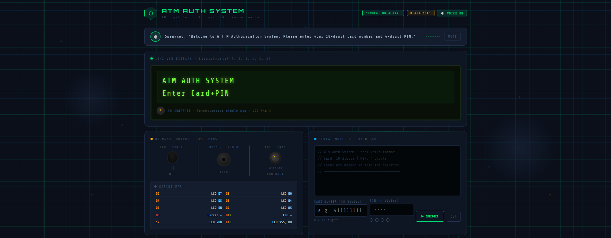
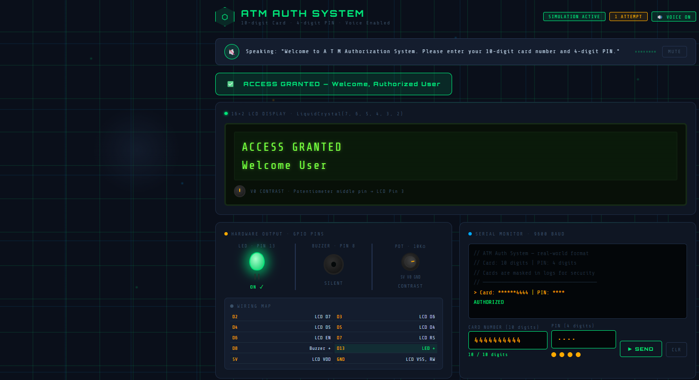
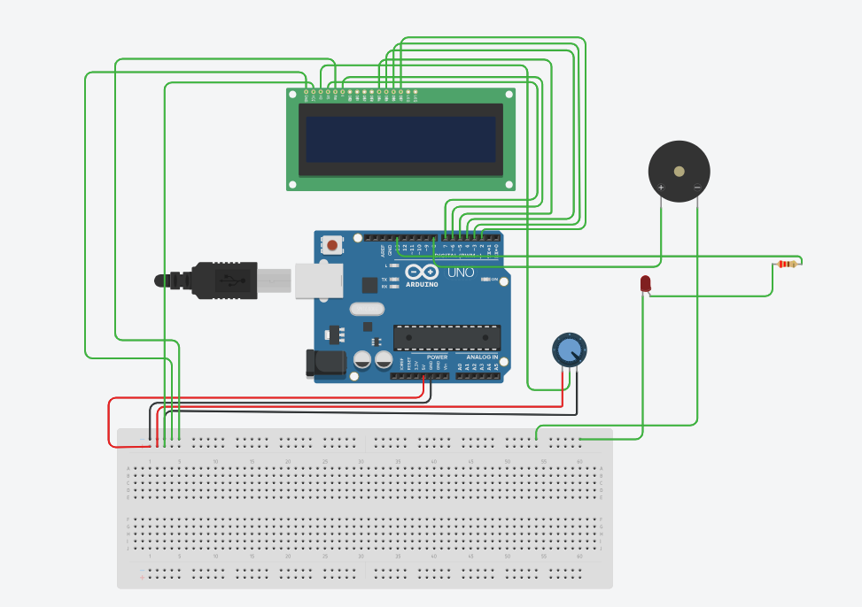

# ⬡ ATM Authorization System — Microprocessor Simulation

A high-fidelity, web-based simulation of a microprocessor-driven ATM authentication system. This project demonstrates modular software architecture mimicking hardware peripheral drivers, featuring voice-guided interaction, real-time GPIO feedback, and a persistent credential database.

## 🚀 Novelty of the Project

Unlike standard web authentication forms, this simulation replicates the **architectural constraints and feedback loops** of an embedded system (like an Arduino/8051/ARM-based ATM):

1.  **Hardware-Software Co-Simulation**: Every action in the software triggers a "hardware" response (Buzzer, LED, LCD pins).
2.  **Voice-Enabled Accessibility**: Integrates a voice synthesis engine to simulate modern accessible ATM interfaces.
3.  **Real-Time Serial Debugging**: A dedicated serial monitor window simulates UART (Universal Asynchronous Receiver-Transmitter) communication, providing a low-level look at the "firmware" operation.
4.  **Peripheral Driver Architecture**: The code is refactored into distinct JS classes that act as drivers for virtual hardware, moving away from monolithic UI-logic coupling.

## ⚙️ How it Works: Microprocessor Logic

The project is structured to mimic the execution flow of a microprocessor:

### 1. Peripheral Initialization (`setup()`)
Upon loading, the `ATMController` (the "Main CPU") initializes all peripherals:
- **LCD Driver**: Clears the 16x2 display and sets the initial message.
- **Hardware Interface**: Maps virtual GPIO pins (D2-D13) and builds the electrical wiring map.
- **Serial Monitor**: Opens a 9600 baud communication channel for logging.
- **Database (EEPROM)**: Loads authorized credentials from persistent storage (`localStorage`).

### 2. Interrupt & Input Handling
- The system remains in a "wait" state for user input.
- **GPIO Mapping**: Interactions with the card/PIN fields simulate interrupt-driven inputs.
- **UART Communication**: When "SEND" is clicked, the system "transmits" data packets to the processing logic.

### 3. Logic Execution (Firmware)
The `ATMController` executes a validation routine:
- **Masking**: Simulates secure memory handling by masking card numbers in logs.
- **Conditional Branching**: A comparison occurs between the input registers and the database records.
- **GPIO Output**: 
    - **Success**: `digitalWrite(Pin_13, HIGH)`, `lcd_print("ACCESS GRANTED")`.
    - **Failure**: `digitalWrite(Pin_8, PWM_SIGNAL)` for the buzzer, `lcd_print("ACCESS DENIED")`.

### 4. Hardware Feedback
- **LCD (Liquid Crystal)**: Mimics the `LiquidCrystal` library methods (`setCursor`, `print`) for the 16x2 display.
- **Buzzer/LED**: Visual animations are synced with Web Audio frequency oscillators to simulate electronic components.

## 📁 Project Structure

- `index.html`: The frontend "Console".
- `js/Database.js`: Virtual EEPROM / Persistent Storage.
- `js/LCDDriver.js`: Virtual 16x2 LCD Driver.
- `js/HardwareInterface.js`: GPIO and Circuit management.
- `js/VoiceController.js`: Voice synthesis and Audio peripheral.
- `js/SerialMonitor.js`: UART Serial Terminal simulation.
- `js/ATMController.js`: The "Firmware" / Main system logic.

---
### Sample project Screenshot

---
### Access Granted on Correct pin

---

---
### Tinkercad Circuit

---

**Note**: This project follows strict Microprocessor design principles where logic is decoupled from the hardware interface.